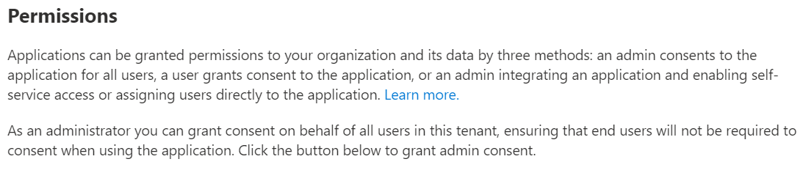
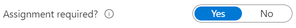
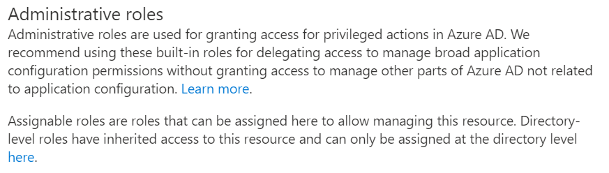
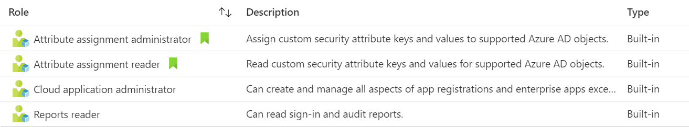
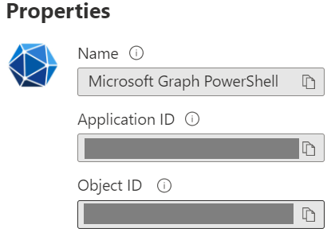

# TaC Tenant-as-Code PoC

## Goals

Manage M365-Tenants with DevOps and GitOps principles and methods.  
To explore the given possibilities existing tools provided by other developers are used.  

## Tech Choices

Inspired by [Thoughworks Tech Radar](https://www.thoughtworks.com/radar).

ADOPT
- MS PS-Modules
- [M365DSC](https://github.com/pdq21/M365-TaC-DSC#intunecd)

TRIAL
- [IntuneCD](https://github.com/pdq21/M365-TaC-DSC#intunecd) with Python3 solely using MS Graph
- [M365/Intune Docu](https://github.com/pdq21/M365-TaC-DSC#m365intune-docu) using MS Graph

ASSESS
- Using MS Graph to access M365 without PS-Modules

HOLD
- Manual undocumented changes
- Undocumented manual changes
- Undocumented changes
- Manual changes
- Undocumented changes with CLI

## Custom Toolset

This collection is work-in-progress and displays some ideas.  
The main purpose is to develop data structures to manage and document M365 state of objects.  
In order to provide legible output for humans  
Not all scripts are functional yet.

### Structure

- `IAM` for groups and users, e.g. AAD and PIM
- `MDM` for Intune devices, e.g. LOB-Software, Autopilot, Configration Profiles, Baselines
- `Tenant`, e.g. Apps, Identity and Security Scores

## Microsoft M365 Desired State Configuration

This projects offers import, export and comparison of M365 configurations.  
The configurations can be saved as JSON-like DSC-Objects and versioned by SCM/VCS. 

- [M365DSC Project Page](https://microsoft365dsc.com)
- [M365DSC on Github](https://github.com/microsoft/Microsoft365DSC)
- [Available Components](https://export.microsoft365dsc.com/)

### Structure

- `M365DSC-export`
- `M365DSC-export-quick`
- `M365DSC-helper`
- `Blueprints` contains simple examples 

## M365/Intune Docu

This project provides export of M365 as wall as Intune and CA settings.  
The file types used are DOCX, CSV and JSON.

- [M365Documentation]( https://github.com/ThomasKur/M365Documentation)
- [Intune and AAD CA Documentation](https://github.com/ThomasKur/IntuneDocumentation)

### Structure

- `WPN-Install-Modules`
- `WPN-Invoke-M365-Docu`

## IntuneCD

Uses Python3 and MS Graph for intented MacOS audiance.  
May be a possibility to be used platform agnostic.

- TODO

### Structure

- TODO

## About Enterprise Apps

- Owners, users and groups can be assigned
- Built-in roles can be assigned

### Possibly needed Apps

- [MS Graph](https://docs.microsoft.com/en-us/graph/powershell/get-started)
- [Microsoft Intune PowerShell](https://www.microsoft.com/en-us/cloud-platform/microsoft-intune)
- [MS PnP Management Shell](https://pnp.github.io/)

### Register Apps

- Some modules offer built-in app registration
- Otherwise manual registration may be neccessary

### Consent to Apps

- Grant admin consent and [Review permissions granted to applications](https://docs.microsoft.com/en-us/azure/active-directory/manage-apps/manage-application-permissions) 
- Maybe require that users mus be assigned to apps and can not assign themselves

### App roles offered by AAD

## About MS Graph

- App Registrations
  - Directory unique Application ID
  - template for configuration of e.g. API Permissions, Client Secrets, Branding, App Roles
  - customizations get written to app manifest file
- Enterprise Registration
  - Directory unique Service Principal Object ID
  - 'The service principal object defines what the app can actually do in the specific tenant, who can access the app, and what resources the app can access.'
[Application and service principal objects in Azure Active Directory](https://docs.microsoft.com/en-us/azure/active-directory/develop/app-objects-and-service-principals)

## Notes

- Make sure SSPR is implemented properly otherwise the credentials may not be passed and the PS login-form may pop up
